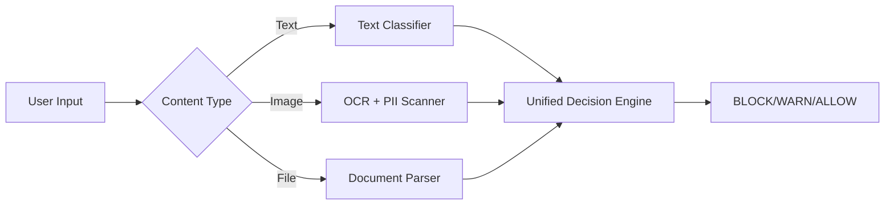

# 🚀 R&D Innovation Roadmap: Next-Gen PII Detection System
## Chief R&D Brainstorm - Making AI Inspector Unique

---

## Executive Summary

Your current system uses **Logistic Regression + TF-IDF + Regex** for intent-aware PII detection. While effective, this is table-stakes in 2025. To differentiate, we need to leverage cutting-edge ML innovations that competitors aren't offering.

---

## 🎯 Market Gap Analysis

| Existing Solutions | What They Do | Our Opportunity |
|-------------------|--------------|-----------------|
| Traditional DLP | Regex-only blocking | **Intent-aware + Context-aware** |
| Microsoft Purview | Data discovery | **Real-time browser interception** |
| Symantec DLP | Enterprise focus | **LLM-specific protection** |
| Strac | API-level scanning | **Behavioral analytics** |

---

## 💡 Innovation Ideas (Prioritized)

### Phase 1: Immediate Differentiators (2-4 weeks)

#### 1. **Transformer-Based Intent Detection** 🧠
Replace `LogisticRegression` with **DeBERTaV3** or **DistilBERT** for dramatically better accuracy.

```
Current:  TF-IDF → LogisticRegression (~85% accuracy)
Proposed: DeBERTaV3 → Fine-tuned NER (~99% accuracy)
```

> [!TIP]
> **Unique Angle**: Fine-tune specifically on **Indian PII** (PAN, Aadhaar, Indian phone formats) which global solutions ignore.

**Implementation**:
```python
# Replace in train_model.py
from transformers import AutoModelForSequenceClassification, AutoTokenizer

model = AutoModelForSequenceClassification.from_pretrained(
    "microsoft/deberta-v3-small",
    num_labels=2  # DISCLOSURE / NON_DISCLOSURE
)
```

---

#### 2. **Multi-Modal PII Detection** 📸
Extend beyond text to detect PII in:
- **Images** (screenshots of IDs, PAN cards pasted into chat)
- **Files** (PDF uploads containing sensitive data)

> [!IMPORTANT]
> **Unique Angle**: No browser extension currently scans images/files BEFORE they're sent to ChatGPT.

**Architecture**:


---

#### 3. **Adversarial Jailbreak Detection** 🛡️
Detect when users are trying to **bypass** the PII filter using:
- Unicode tricks (`jоhn@gmail.com` with Cyrillic 'о')
- Encoded text (Base64, ROT13)
- Split disclosure ("my email is john", "at gmail dot com")

**Implementation**:
```python
def detect_obfuscation(text):
    checks = {
        'unicode_homoglyph': has_mixed_scripts(text),
        'base64_encoded': is_base64(text),
        'split_disclosure': detect_multi_message_pattern(session_history),
        'leetspeak': detect_leetspeak_pii(text),
    }
    return any(checks.values())
```

---

### Phase 2: Advanced Features (1-2 months)

#### 4. **Behavioral Analytics (UEBA)** 📊
Track user behavior patterns to detect anomalies:
- Sudden increase in disclosure attempts
- Unusual working hours
- Copy-paste patterns from external sources

> [!CAUTION]
> **Unique Angle**: Build a "PII Risk Score" per user based on historical behavior.

**Data Model**:
```python
class UserBehaviorProfile:
    user_id: str
    disclosure_attempts: int  # Last 30 days
    block_bypasses: int       # Attempts to circumvent
    risk_score: float         # 0.0 - 1.0
    anomaly_alerts: list      # Triggered events
```

---

#### 5. **Session-Aware Context Memory** 🧵
Current system analyzes each message in isolation. Upgrade to:
- Track conversation context across messages
- Detect **gradual disclosure** (spreading PII across multiple messages)
- Understand if earlier context makes current message a disclosure

**Example**:
```
Message 1: "I need to share my contact info"
Message 2: "It's rahul"
Message 3: "at gmail.com"
→ System detects: EMAIL disclosure across 3 messages!
```

**Architecture**:
```python
class SessionMemory:
    def __init__(self, window_size=10):
        self.messages = deque(maxlen=window_size)
    
    def analyze_with_context(self, new_message):
        self.messages.append(new_message)
        full_context = " ".join(self.messages)
        return classifier.classify(full_context)
```

---

#### 6. **LLM-Powered Semantic Analysis** 🤖
Use a small LLM (Phi-3, Gemma-2B) as a "second opinion" for edge cases:

```
Prompt: "Analyze if this contains real PII disclosure:
'contact me at my work number 9876543210'
Consider: Is this real contact info or example data?"
```

> [!NOTE]
> Only invoke LLM for WARN cases (not BLOCK/ALLOW) to save costs.

---

### Phase 3: Enterprise Differentiators (2-3 months)

#### 7. **Custom PII Taxonomy Builder** 🔧
Allow enterprises to define their own PII types:
- Project codes
- Internal employee IDs
- Customer account numbers
- API keys / secrets

**UI Concept**:
```
┌─────────────────────────────────────────────────┐
│ Custom PII Rule Builder                         │
├─────────────────────────────────────────────────┤
│ Name: [AWS API Key                        ]     │
│ Pattern: [AKIA[0-9A-Z]{16}               ]     │
│ Severity: [●] Critical  [ ] High  [ ] Medium   │
│ Action:   [●] Block     [ ] Warn  [ ] Log      │
│                                                 │
│ [+ Add Context Phrases]                         │
│   • "my api key is"                            │
│   • "use this access key"                      │
└─────────────────────────────────────────────────┘
```

---

#### 8. **Federated Learning for Privacy-Preserving Model Updates** 🔐
Train model improvements WITHOUT seeing actual PII:
- Each enterprise trains locally
- Only model gradients are shared
- Central model improves without data exposure

> [!TIP]
> **Marketing Angle**: "Your PII never leaves your premises, but your protection improves globally."

---

#### 9. **Compliance Dashboard with GDPR/DPDP Mapping** 📋
Map each detection to specific regulatory requirements:

| PII Type | GDPR Article | DPDP Section | Auto-Action |
|----------|-------------|--------------|-------------|
| Email | Art. 4(1) | Sec. 2(i) | WARN |
| Aadhaar | N/A | Sec. 3(3) | BLOCK |
| Biometric | Art. 9 | Sec. 2(j) | BLOCK |

---

## 🏗️ Technical Implementation Priority

### High Impact + Low Effort (Start Here)
| Innovation | Effort | Impact | Priority |
|------------|--------|--------|----------|
| DeBERTaV3 upgrade | Medium | Very High | ⭐⭐⭐ |
| Adversarial detection | Low | High | ⭐⭐⭐ |
| Session context | Medium | High | ⭐⭐⭐ |

### High Impact + High Effort (Next Quarter)
| Innovation | Effort | Impact | Priority |
|------------|--------|--------|----------|
| Multi-modal (images) | High | Very High | ⭐⭐ |
| Behavioral analytics | High | Very High | ⭐⭐ |
| Custom PII builder | Medium | High | ⭐⭐ |

### Future Roadmap
| Innovation | Effort | Impact | Priority |
|------------|--------|--------|----------|
| LLM second opinion | Medium | Medium | ⭐ |
| Federated learning | Very High | Medium | ⭐ |
| Compliance mapping | Medium | Medium | ⭐ |

---

## 🎨 Unique Value Propositions

After implementing these innovations, your positioning becomes:

```
┌────────────────────────────────────────────────────────────────┐
│                     AI INSPECTOR                               │
│         "The Only PII Shield Built for the LLM Era"           │
├────────────────────────────────────────────────────────────────┤
│ ✓ Intent-Aware (not just pattern matching)                    │
│ ✓ India-First (PAN, Aadhaar, Indian phones)                   │
│ ✓ Multi-Modal (text + images + files)                         │
│ ✓ Jailbreak-Resistant (detects obfuscation)                   │
│ ✓ Privacy-Preserving (federated learning)                     │
│ ✓ Enterprise-Ready (custom taxonomies)                        │
└────────────────────────────────────────────────────────────────┘
```

---

## 📊 Success Metrics

| Metric | Current | Target |
|--------|---------|--------|
| Classification Accuracy | ~85% | 99%+ |
| False Positive Rate | ~15% | <2% |
| Latency (ms) | ~10ms | <50ms |
| PII Types Detected | 6 | 20+ |
| Bypass Resistance | Basic | Advanced |

---

## 🔬 Recommended First Sprint

1. **DeBERTaV3 Integration** (5-7 days)
   - Fine-tune on existing dataset
   - A/B test against LogisticRegression
   - Benchmark accuracy & latency

2. **Adversarial Detection Module** (3-4 days)
   - Unicode homoglyph detection
   - Base64/encoding detection
   - Leetspeak normalization

3. **Session Context Memory** (3-4 days)
   - Implement sliding window
   - Cross-message PII detection
   - Unit tests for split disclosures

---

*Document Created: 2026-02-04*
*Last Updated: 2026-02-04*
